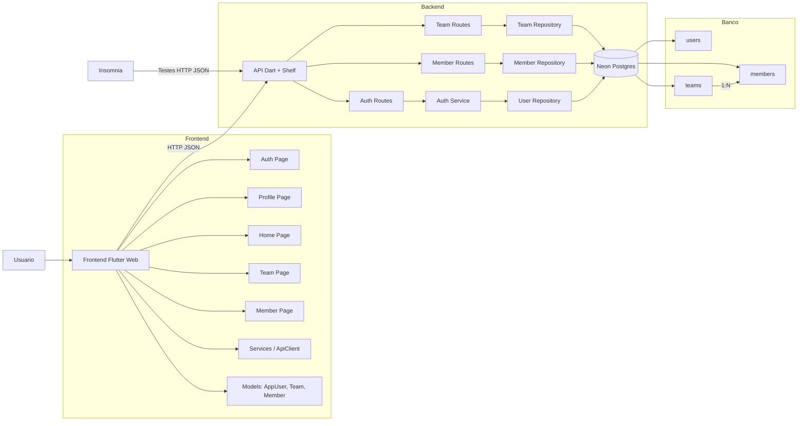
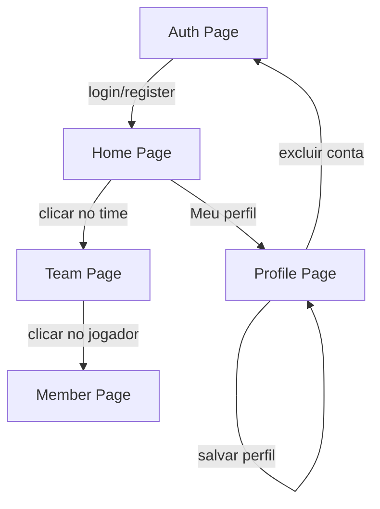
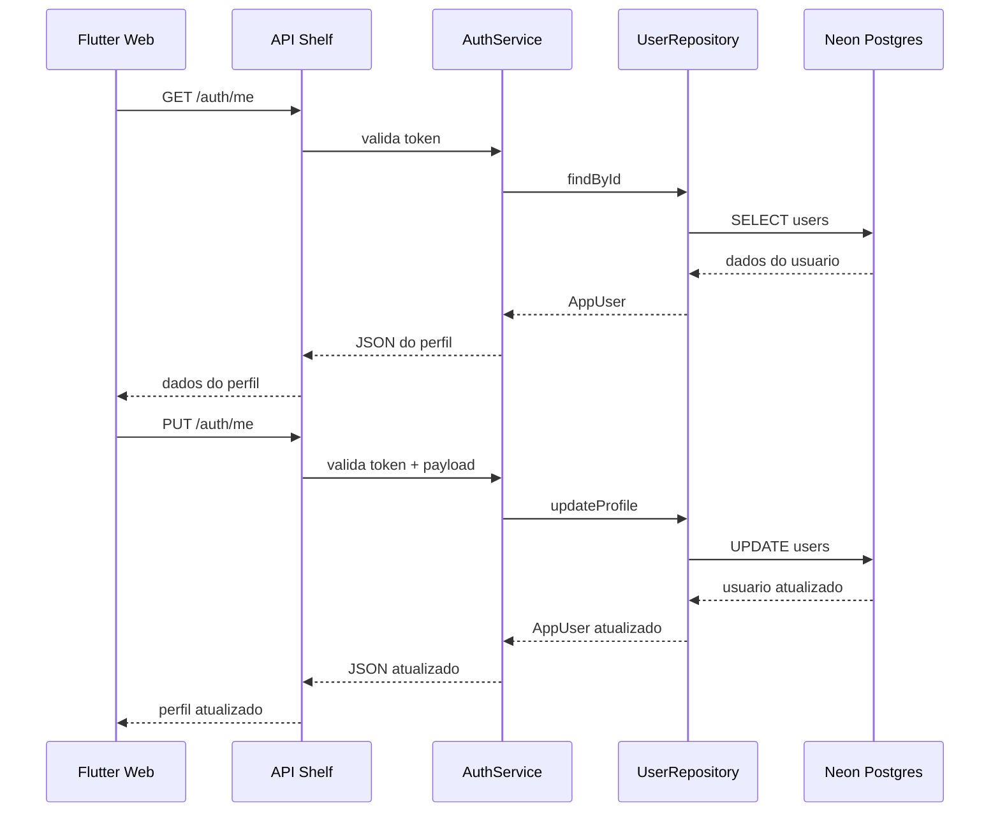
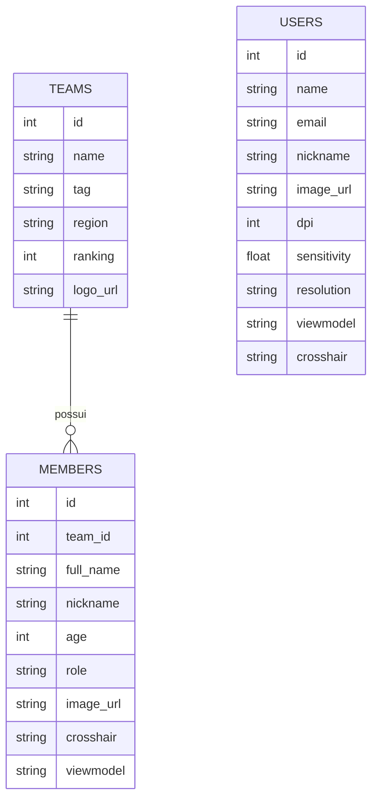

# Arquitetura - CS2 Players Hub

Este diagrama resume a arquitetura do projeto e o fluxo principal das telas.

```mermaid
flowchart LR
  U[Usuario] --> F[Frontend Flutter Web]

  F -->|HTTP JSON| A[API Dart + Shelf]
  I[Insomnia] -->|Testes HTTP JSON| A

  subgraph Frontend
    F --> FA[Auth Page]
    F --> FP[Profile Page]
    F --> FH[Home Page]
    F --> FT[Team Page]
    F --> FM[Member Page]
    F --> FS[Services / ApiClient]
    F --> MODELS[Models: AppUser, Team, Member]
  end

  subgraph Backend
    A --> R1[Auth Routes]
    A --> R2[Team Routes]
    A --> R3[Member Routes]

    R1 --> S1[Auth Service]
    R2 --> RE1[Team Repository]
    R3 --> RE2[Member Repository]

    S1 --> RE3[User Repository]
    RE1 --> DB[(Neon Postgres)]
    RE2 --> DB
    RE3 --> DB
  end

  subgraph Banco
    DB --> T1[users]
    DB --> T2[teams]
    DB --> T3[members]
    T2 -->|1:N| T3
  end
```

## Fluxo de navegacao

```mermaid
flowchart TD
  A[Auth Page] -->|login/register| H[Home Page]
  H -->|Meu perfil| P[Profile Page]
  H -->|clicar no time| T[Team Page]
  T -->|clicar no jogador| M[Member Page]
  P -->|salvar perfil| P
  P -->|excluir conta| A
```

## Fluxo de dados do perfil

```mermaid
sequenceDiagram
  participant Flutter as Flutter Web
  participant API as API Shelf
  participant Auth as AuthService
  participant Repo as UserRepository
  participant DB as Neon Postgres

  Flutter->>API: GET /auth/me
  API->>Auth: valida token
  Auth->>Repo: findById
  Repo->>DB: SELECT users
  DB-->>Repo: dados do usuario
  Repo-->>Auth: AppUser
  Auth-->>API: JSON do perfil
  API-->>Flutter: dados do perfil

  Flutter->>API: PUT /auth/me
  API->>Auth: valida token + payload
  Auth->>Repo: updateProfile
  Repo->>DB: UPDATE users
  DB-->>Repo: usuario atualizado
  Repo-->>Auth: AppUser atualizado
  Auth-->>API: JSON atualizado
  API-->>Flutter: perfil atualizado
```

## Relacionamento principal

```mermaid
erDiagram
  TEAMS ||--o{ MEMBERS : possui
  USERS {
    int id
    string name
    string email
    string nickname
    string image_url
    int dpi
    float sensitivity
    string resolution
    string viewmodel
    string crosshair
  }
  TEAMS {
    int id
    string name
    string tag
    string region
    int ranking
    string logo_url
  }
  MEMBERS {
    int id
    int team_id
    string full_name
    string nickname
    int age
    string role
    string image_url
    string crosshair
    string viewmodel
  }
```
